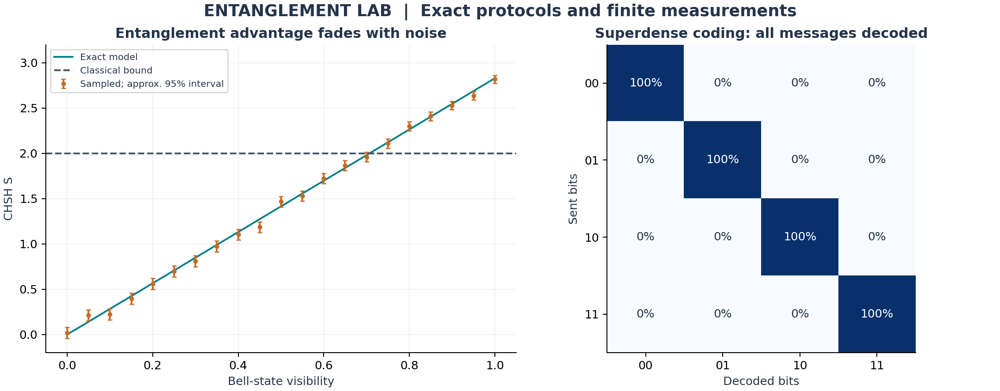

# Entanglement Lab
### Quantum communication · Experimental validation · Noise sensitivity

**Question:** What can shared entanglement accomplish, and how can its advantage be tested?

This standalone Python project implements quantum teleportation, superdense coding, and a CHSH experiment. Exact state-vector results are checked against mathematical references, then compared with finite-measurement estimates under a synthetic noise model.



## Results at a glance

| Experiment | Default result | Interpretation |
| --- | --- | --- |
| Teleportation | Fidelity approximately 1 across 100 random states and all 400 branches | The corrected receiver state matches the input up to global phase. |
| Superdense coding | All four two-bit messages decoded with probability 1 | Ideal decoding works with a pre-shared Bell pair. |
| CHSH | S = 2.828427 versus classical bound 2 | The ideal entangled strategy violates the classical bound. |
| Synthetic noise | Violation requires visibility greater than about 0.7071 | The advantage is sensitive to the quality of the shared state. |

Generated results and environment versions: [summary.json](results/summary.json). Values are simulation outputs, not hardware measurements.

## Run it

Python 3.11+ is required. Run from this repository's root:

```bash
python -m venv .venv
source .venv/bin/activate
python -m pip install -r requirements.txt
python -m unittest discover -v
python run.py --seed 2023 --output results
```

On Windows, activate with `.venv\Scripts\activate` instead. No cloud account or API key is needed. The dependencies are pinned to the versions used for the checked-in results.

## Method

**State convention:** qubit 0 is the leftmost, most-significant qubit; amplitudes use computational-basis ordering.

1. Prepare the Bell state with H on qubit 0 followed by CNOT.
2. For teleportation, simulate the three-qubit circuit, project onto every pair of Alice outcomes, normalize Bob's conditional state, and apply the corresponding X and Z corrections.
3. For superdense coding, encode each pair of bits with local Pauli gates and invert the Bell preparation.
4. For CHSH, use Alice observables Z and X and Bob observables (Z+X)/sqrt(2) and (Z-X)/sqrt(2).

The noisy state is `rho = v |Phi+><Phi+| + (1-v) I/4`. This gives `S = 2 sqrt(2) v`. Each CHSH setting uses 4,096 independent shots. Error bars are approximate 95% normal intervals based on the model's exact sampling variance; they are not a loophole-free experimental Bell test.

Teleportation requires two classical bits and a pre-shared entangled pair. Superdense coding also consumes shared entanglement. Neither demonstration implies faster-than-light communication.

## Explore the implementation

| File | Purpose |
| --- | --- |
| [quantum.py](quantum.py) | Gates, conditional teleportation branches, decoding, and CHSH observables. |
| [test_quantum.py](test_quantum.py) | Six tests covering unitarity, reduced states, random complex inputs, all messages, and classical/quantum bounds. |
| [run.py](run.py) | Reproducible experiments and plots. |
| [results](results/) | CSV data, summary JSON, and the generated chart. |

## Why the result matters

The project demonstrates a useful evaluation pattern: define a resource and baseline, reproduce an ideal result, then examine sensitivity to uncertainty. It is a learning experiment, not an assessment of a commercial quantum-network investment.

**Extend it:** add local amplitude damping, compare its effect with global depolarization, and report teleportation fidelity over the same input states.

## Course connection and provenance

Based on summer 2023 studies of single/multiple states, quantum circuits, and entanglement protocols. Created as a new implementation in September 2026. See [source mapping](SOURCES.md), [provenance](PROVENANCE.md), and [MIT license](LICENSE).
